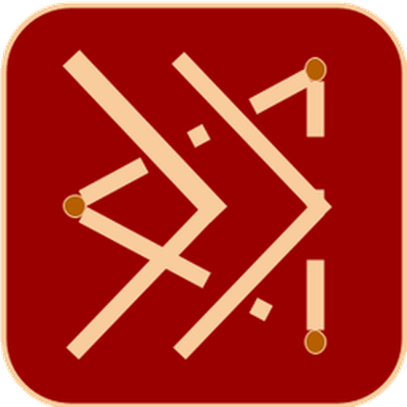
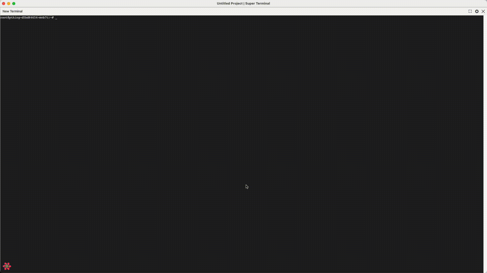

<h1 align="center">
  <br/>
  Super Terminal
</h1>

<p align="center">
  <strong>A terminal manager that remembers everything so you don't have to.</strong><br/>
  Restore terminals after reboot. Run multi-service projects with one click. Access from any machine over LAN.
</p>

<p align="center">
  <a href="https://github.com/bugwheels94/super-terminal/releases/latest">Download</a> ·
  <a href="#installation">Install</a> ·
  <a href="#features">Features</a>
</p>

---

<p align="center">
  
</p>

## Features

- **Session restoration** — terminals, logs, and scroll position survive reboots
- **Project workspaces** — group related terminals together, launch everything with one click
- **Startup commands** — auto-run commands like `git config --user.name` when opening a project
- **Environment variables** — set once per project, never type them again
- **Clone terminals** — duplicate with same cwd, env vars, and settings
- **Themes** — apply any theme from [Windows Terminal Themes](https://windowsterminalthemes.dev/)
- **Multiline input** — double-click any terminal to enter multiline commands (curl, etc.)
- **Shell scripts** — save frequent commands and execute with a click
- **Auto-cleanup** — configurable max log size per project, auto-deletes old logs
- **LAN access** — run headless on a server, use from any browser on your network
- **Oh My Zsh compatible**

## Installation

### Desktop App

Available for **macOS** (Apple Silicon), **Linux**, and **Windows**.

| Method | Command |
|--------|---------|
| **Homebrew** (macOS) | `brew install bugwheels94/super-terminal/super-terminal --cask` |
| **Direct download** | [Latest Release](https://github.com/bugwheels94/super-terminal/releases/latest) |

<details>
<summary>macOS: "app is damaged" warning fix</summary>

```bash
sudo xattr -d com.apple.quarantine /Applications/Super\ Terminal.app
```
</details>

### Headless Server

For remote machines, servers, or running without a GUI.

| Method | Command |
|--------|---------|
| **Shell script** | `curl -fsSL https://raw.githubusercontent.com/bugwheels94/super-terminal/master/install.sh \| sh` |
| **Homebrew** | `brew install bugwheels94/super-terminal/super-terminal-headless` |
| **Direct download** | [Latest Release](https://github.com/bugwheels94/super-terminal/releases/latest) |

## Usage

**Desktop:** Launch Super Terminal from your Applications folder or start menu.

**Headless:**

```bash
super-terminal-headless
# Open http://localhost:3879 in your browser
```

## Configuration

Config file: **`~/.config/super-terminal/config`** (YAML)

```yaml
port: 3879
host: 127.0.0.1
```

Override via CLI flags or environment variables:

```bash
# CLI flags
super-terminal-headless --port 4000 --host 0.0.0.0

# Environment variables
SUPER_TERMINAL_PORT=4000 SUPER_TERMINAL_HOST=0.0.0.0 super-terminal-headless
```

## Development

```bash
npm install                          # Install dependencies
npm run tauri dev                    # Dev mode (Tauri + Vite)
npm run tauri build                  # Build desktop app
cargo build --release -p super-terminal  # Build headless server
```

## License

MIT
