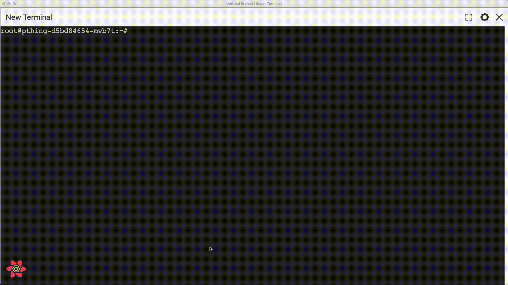

<h1 align="center">Super Terminal</h1>
<p align="center">Manage Terminals Easy! And Save Time!</p>
<p align="center">
	
</p>

1. Do you find **opening terminal after reboot** boring?
2. Do you **work on multiple folders**, like monorepo or full stack projects, in parallel?
3. Do you **need environment variables** always in some project?
4. Is running a project requires you to **run multiple commands** in different folders and you wanna automate that?
5. Do you want to open terminal from **other machine** over LAN using HTTP?

## In Action



## Introduction

Super Terminal is a terminal manager for developers who dont like repetition and work fast. If saving time is the basic decision maker for your actions then super terminal might suite you well.

## Features

1. **Restoration** of terminal with logs after reboot
2. Fit Terminals on Screen with a single click
3. Ability to run command at start while opening the project like `git config --user.name`
4. Run project with one click
5. Set Environment Variables once and never again
6. **Clone Terminal** with same current directory, env variables
7. Ability to group related terminals together under 1 project within view.
8. Themes can be applied: https://windowsterminalthemes.dev/
9. Easily **enter multiline commands like curl** by double clicking on any temrinal
10. Works with [oh my zsh](https://ohmyz.sh/)
11. Save **frequent commands as shell scripts** and execute with a click.

## Upcoming Features

1. Tab View Support
2. Search in terminal log archives
3. Save State option: This option will allow to capture env variable and cwd from inside the terminal whenever dev will require.

## Installation

### Available for Linux, Windows and Mac.

Please go to latest release: [Latest Release](https://github.com/bugwheels94/super-terminal/releases/latest)

NOTE: If Apple Silicon build fails to run then please run the below command after extracting the zip

```
sudo xattr -d com.apple.quarantine SuperTerminal.app
```

### Node.JS

    npm i super-terminal

Open in Browser at: http://localhost:3879
